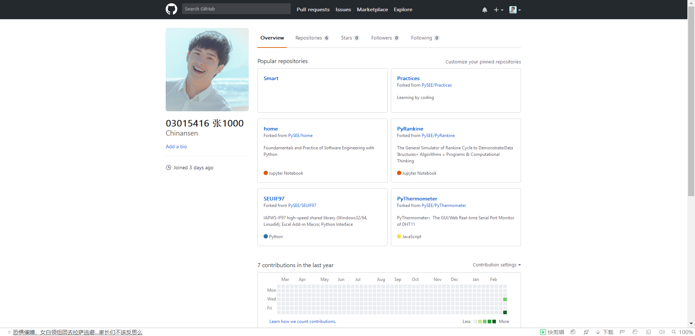
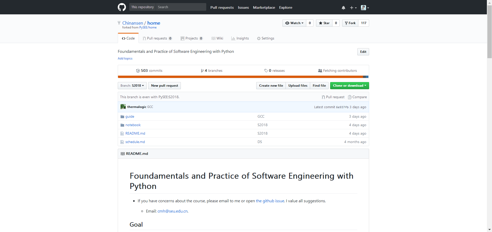
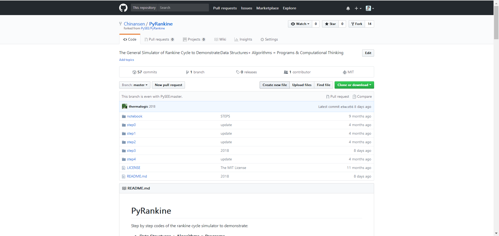
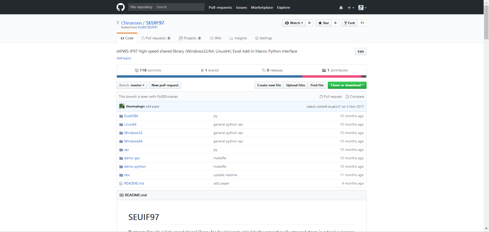

# 
**软件工程作业一**
### 
0301516 张艺骞

## 一. 个人Github账户
&emsp;&emsp;账户名：Chinansen  
&emsp;&emsp;注册邮箱：2929077399@qq.com  
&emsp;&emsp;账户主页面截图(fork课程仓库后)：  

   

## 二. Github 简介
### 1、什么是Github
&emsp;&emsp;GitHub是一个面向开源及私有软件项目的托管平台，因为只支持git 作为唯一的版本库格式进行托管，故名gitHub。GitHub可以托管各种git库，并提供一个web界面，但与其它像 SourceForge或Google Code这样的服务不同，GitHub的独特卖点在于从另外一个项目进行分支的简易性。为一个项目贡献代码非常简单：首先点击项目站点的“fork”的按钮，然后将代码检出并将修改加入到刚才分出的代码库中，最后通过内建的“pull request”机制向项目负责人申请代码合并。已经有人将GitHub称为代码玩家的MySpace。

### 2、Github的组成部分 (作为 green hand 我抱住百度)
>* *Repository*：分为公共仓库和私人仓库，仓库包含了所有的：版本、分支、标记信息。  
>* *Explore*：发现、查看、研究Github上公共仓库中托管的代码项目。  
>* *Gist*：有版本控制的代码粘贴服务，由此可以方便地共享文本或代码。  
>* *Blog*：个人博客，只要向Github提交Commit就能发布新文章。  
>* *Watch*：将感兴趣的仓库加入关注列表，如果所关注的仓库有更新会动态的进行邮件通知。  
>* *Star*：一种更新的方式管理你所感兴趣的仓库的记录，任何之前预览过的仓库都能在其页面中找到。  
>* *Fork*：最重要的功能之一，克隆别人仓库的代码到自己的项目中。可以作为子模块的形式使用，或二次开发。
### 3、Github还能干点啥
1. **写文档、书籍**  
一个文档需经过不断的修订润色，也就是不断的迭代过程,最终才能令人满意。这时我们就可以借助 git branch 和 git rebase 等，在不同版本间进行切换。其分支管理的功能真的很方便。
2. **团队建设**  
当你在Github中发起一个项目时，整个团队的工作情况一目了然，这样不仅可以方便大家及时交流沟通、互相督促，也增强了彼此间的陪伴感，整个团队都充满爱了呢！！
3. **富有说服力的简历**  
正如老师上课所说，现在越来越多的公司招聘已经将github作为标尺之一，因为其无法造假,很容易从你关注的项目来了解你知识的广度与深度,从而了解最真实的你。  
4. **建造资源库**  
Github中不仅可以分享资源还能把各种优秀资源fork到自己的口袋里，资源共享，互利共赢。而且存到云端取用方便还不怕丢失，可以说是造福人类了。
## 三. 课程Home、PyRankine和SEUIF97仓库简介  
&emsp;&emsp;Home、PyRankine和SEUIF97都是上面所说的“Repository”，我现在已经将它们从PySEE拥有者那里fork到了自己的仓库中，相当于我在原项目的主分支上又建立了一个分支，我可以在该分支上任意修改，如果想将我的修改合并到原项目中时，可以pull request，这样原项目的作者就可以将我修改的东西合并到原项目的主分支上去，这样我就为开源项目贡献了代码，开源项目就会在大家共同的努力下不断壮大和完善。  
 

 
### 1. Home仓库：  

  
 
  

(Home主页面)

&emsp;&emsp;Home仓库算是我们学习的课件吧，仓库中的guide文件夹内中的内容是说明我们学习前的准备工作，包括软件环境的建立(即对必要软件安装方法的介绍)、markdown介绍和给出一些对我们有帮助的参考教程和网站。notebook文件夹中的是对Python语言学习的课件和一些可供参考和学习的代码。README.md文件是对我们这门课程的介绍，默认是打开的，包括我们这门课程的学习目标、所需材料和书本、课程内容、课程评分和课程内容更新方法。这个仓库是我们学习编程理论的基础仓库，其中包含了：
- 课前的准备，例如在自己的电脑上搭建编程环境
- 课程文档
- 参考书籍与网站
- 常见问题的解答等  

&emsp;schedule.md文件是对我们这门课程安排的介绍。 

### 2. PyRankine仓库：  

  

(PyRankine主页面)
  
&emsp;&emsp;郎肯循环是我们专业一个重要的内容，也是我们专业学习和研究的基础，PyRankine仓库主要介绍如何利用Python语言模拟和计算郎肯循环，数据结构+算法=程序或者计算思维。仓库中文件主要介绍了计算思维和编程技巧，通过一步一步拆分讲解的方式，并且给出了郎肯循环的一个编程示例和许多参考网站和教程。  

### 3. SEUIF97仓库：  

  

(SEUIF97主页面)

&emsp;&emsp;SEUIF97仓库是东南大学开发者开发的水和水蒸气性质的计算模型共享库，基于IAPWS-IF97，使用Python语言编写，以便我们以后在工程实际中用来模拟水和水蒸气的热力性质，提高水和水蒸气性质的计算速度。仓库中的文件主要介绍了在windows和Linux环境下的使用方法，给出了很多DEMO程序，可供交互学习，是一个开源的仓库。

